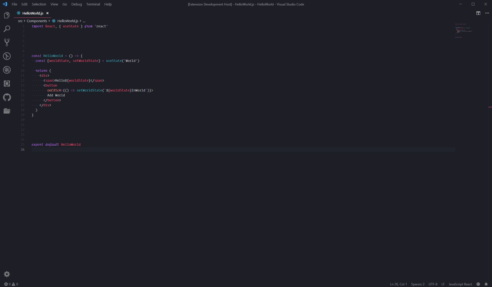

  <h2 align="center">Polacode Automated - less steps, more productivity 😎</h2>

<!--  -->

## Automation Fork

This extenstion is a drop-in replacement for Polacode which has some key QoL changes.

There are 4 new configurable options/features:

* `polacode.defaultPath` - Default save location for snippets.
* `polacode.autoSave` - Automatically save snippet instead of displaying save dialog.
* `polacode.closeOnSave` - Close panel after saving a snippet.
* `polacode.closeOnSaveDelay` - Time before the Polacode window closes.

As well as the other following minor changes:

* Code snippet height can no longer be controlled (you can still adjust the width).
* Snippet container can no longer be resized, force consistent margins around snippet.
    * Both of these changes encourage more consistent looking code screenshots.
* Autofill selected text on panel open.
* Default file name is now `polacode-{timestamp}.png`
* Change behavior of photo button so it behaves a bit more like a button.

## Why this fork?

I love the code snippets polacode produces, but the normal extension lacks the capability to fully automate uploading snippets via ShareX, and I also don't like the snippet resize handles which cause weird spacing and sizing issues. I made these changes to make better snippet screenshots faster, and without the hassle of going through multiple steps that could be easily preconfigured.

I'm currently running this as a manual install extension. I don't exactly want to keep this actively maintained, so don't expect seeing it on the marketplace.

## Why Polacode?

You have spent countless hours finding the perfect [JavaScript grammar](https://marketplace.visualstudio.com/search?term=javascript%20grammar&target=VSCode&category=All%20categories&sortBy=Relevance), matching it with a [sleek-looking VS Code theme](https://marketplace.visualstudio.com/search?target=VSCode&category=Themes&sortBy=Downloads), trying out all the [best programming fonts](https://www.slant.co/topics/67/~best-programming-fonts).

You take three days porting over [your theme](https://github.com/wesbos/cobalt2-vscode) before starting to use VS Code.
You shell out $200 for [italic cursive html attributes](https://www.typography.com/blog/introducing-operator).

The code has to look right.

## Tips

- Resize the snippet / container by dragging the lowerright corner
- Use `polacode.target`, `polacode.shadow`, `polacode.transparentBackground` and `polacode.backgroundColor` to control image appearance

## Demo

[Nord](https://github.com/arcticicestudio/nord-visual-studio-code) + [Input Mono](http://input.fontbureau.com)

[Monokai Pro](https://marketplace.visualstudio.com/items?itemName=monokai.theme-monokai-pro-vscode) + [Operator Mono](https://www.typography.com/blog/introducing-operator)

[Material Theme Palenight](https://marketplace.visualstudio.com/items?itemName=Equinusocio.vsc-material-theme) + [Fira Code](https://github.com/tonsky/FiraCode)

## Credit

Thanks to [Pine](https://github.com/octref) & [Peng](https://github.com/rebornix) for creating this excellent extension.

Thanks to [@tsayen](https://github.com/tsayen) for making [dom-to-image](https://github.com/tsayen/dom-to-image), which Polacode is using for generating the images.

Thanks to [Dawn Labs](https://dawnlabs.io) for making [Carbon](https://carbon.now.sh) that inspired Polacode.

Many color are taken from the elegant [Nord](https://github.com/arcticicestudio/nord) theme by [@arcticicestudio](https://github.com/arcticicestudio).

Download button animation is made with [Vivus](https://github.com/maxwellito/vivus).

## Contribution

Contribution is welcome here. Feel free to PR your improvements.

## License

MIT
